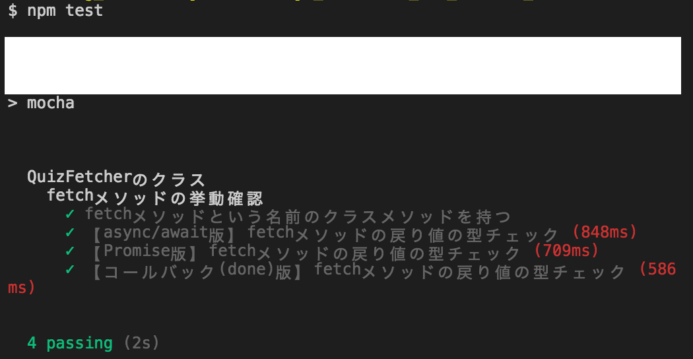

# レポジトリ内容

このレポジトリは[Web白熱教室](https://tsuyopon.xyz/)の[JavaScriptの学習コンテンツ > JavaScriptバックエンド編](https://tsuyopon.xyz/learning-contents/web-dev/javascript/backend/)にある「[【エクササイズ】APIで取得したデータのデータ形式をテストする](https://tsuyopon.xyz/learning-contents/web-dev/javascript/backend/js-excercise-for-backend-4/)」で利用するものです。

### 完成形

## 課題

- 以下の「課題をクリアするためのステップ」の内容を全て対応する
- 対応後、ターミナルで「npm test」を実行したときに「完成形」と同じものが表示されるようにする

### 課題をクリアするためのステップ

1. [ ] package.jsonを作る
1. [ ] node_modulesをgitのバージョン管理から除外する
1. [ ] 必要なライブラリをインストールする
    - [ ] API経由でデータを取得するためのライブラリとして[ `axios` ](https://github.com/axios/axios) を `dependencies` にインストールする
        - `axios` を使ったエクササイズは、以前に「[【エクササイズ】fetchのライブラリでクイズデータを取得する【Node.JS】](https://tsuyopon.xyz/learning-contents/web-dev/javascript/backend/js-excercise-for-backend-2/)」 でも行った
    - [ ] テスト用のライブラリとして「[mocha](https://mochajs.org/)」と「[power-assert](https://github.com/power-assert-js/power-assert)」を `devDependencies` にインストールする
1. [ ] package.jsonのscriptsを修正して「npm test」で `mocha` が実行されるようにする
1. [ ] プロジェクトのルートディレクトリ直下にsrcディレクトリを作成して、srcディレクトリの中に「QuizFetcher.js」というファイルを作成する
1. [ ]  プロジェクトのルートディレクトリ直下にtestディレクトリを作成する。その後、testディレクトリの中にsrcディレクトリを作成する
1. [ ] testディレクトリの中に [`mocha.opts`](https://mochajs.org/#mochaopts)ファイルを作成して「--recursive」オプションを追加する
    - 参照 :
        - `mocha.opts` について : https://mochajs.org/#mochaopts
        - `--recursive` について : https://mochajs.org/#the-test-directory
1. [ ] 「test/src」ディレクトリの中に「QuizFetcher.spec.js」という「src/QuizFetcher.js」に対応するテストファイルを作成する
1. [ ] 「src/QuizFetcher.js」は以下の機能を持つ
    - [ ] `fetch`という名前の `クラスメソッド` を持つ
        - [ ] `fetch` メソッド( `クラスメソッド` )は、`axios`で、以下のURLを使ってデータを取得する
            - https://opentdb.com/api.php?amount=10&type=multiple
        - [ ] `fetch`メソッドの戻り値は、`axios.get`メソッドの実行結果をそのまま返す
1. [ ] 「test/src/QuizFetcher.spec.js」内で、`QuizFetcher.fetch` メソッドで取得するデータとデータ形式をテストする
    - [ ] `results` プロパティを持つ
    - [ ] `results` プロパティはは10件データをもつ配列である
    - [ ] `results` プロパティの配列の中身は全てオブジェクトで、次のプロパティを持つ
        - [ ] `category` プロパティ : 文字列型
        - [ ] `type` プロパティ : 文字列型
        - [ ] `difficulty` プロパティ : 文字列型
        - [ ] `question` プロパティ : 文字列型
        - [ ] `correct_answer` プロパティ : 文字列型
        - [ ] `incorrect_answers` プロパティ : 3件の文字列を含む配列
    - [ ] [`typeof`](https://developer.mozilla.org/ja/docs/Web/JavaScript/Reference/Operators/typeof) を使って、書くプロパティ値の型をテストする
1. [ ] `npm test` を実行して 「test/src/QuizFetcher.spec.js」のテストが全て成功することを確認する(上の完成形の画像と同じような出力になることを確認する)

## 答え

このレポジトリの `answer` ブランチに答えを用意しているので、そちらを参考にしていただけたらと思います。

## 参考記事

課題をこなしていて、行き詰まったら以下の資料を参考にしていただければ解答にたどり着けるかと思います。

- Web白熱教室
    - [【Node.JS】テストの書き方・実行方法を覚える【基本型】](https://tsuyopon.xyz/learning-contents/web-dev/javascript/backend/how-to-write-test-code-for-mocha/)
    - [【mocha】非同期処理のテストを書く①【コールバック関数を使う】](https://tsuyopon.xyz/learning-contents/web-dev/javascript/backend/how-to-write-asyncronous-test-code-with-a-callback-function/)
    - [【mocha】非同期処理のテストを書く②【Promiseを使う】](https://tsuyopon.xyz/learning-contents/web-dev/javascript/backend/how-to-write-asyncronous-test-code-with-promises/)
